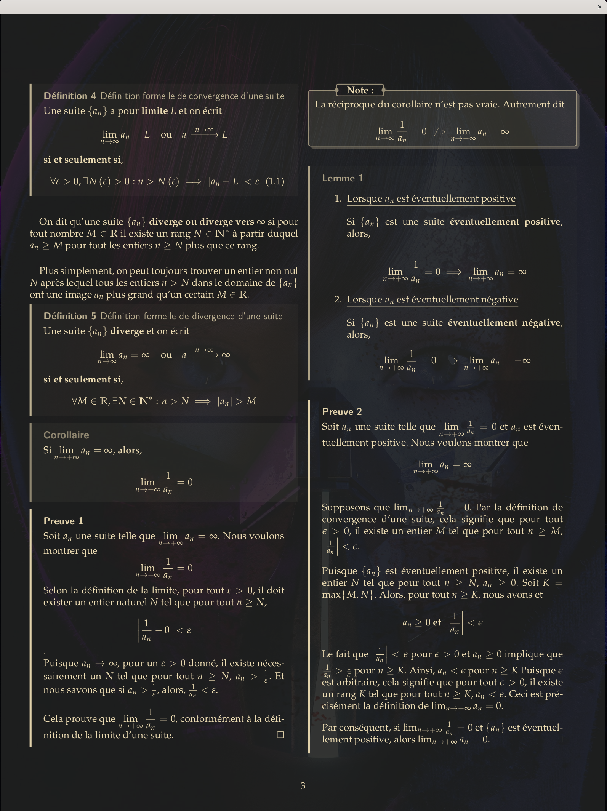
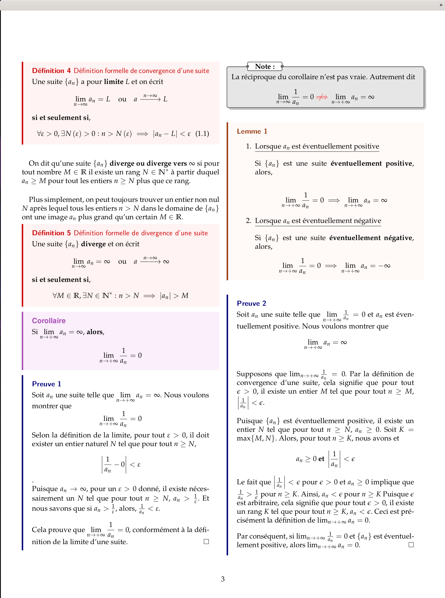
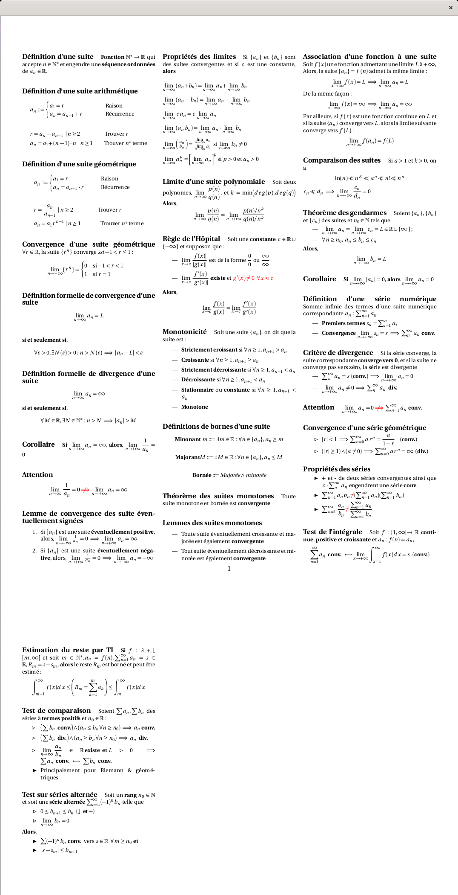
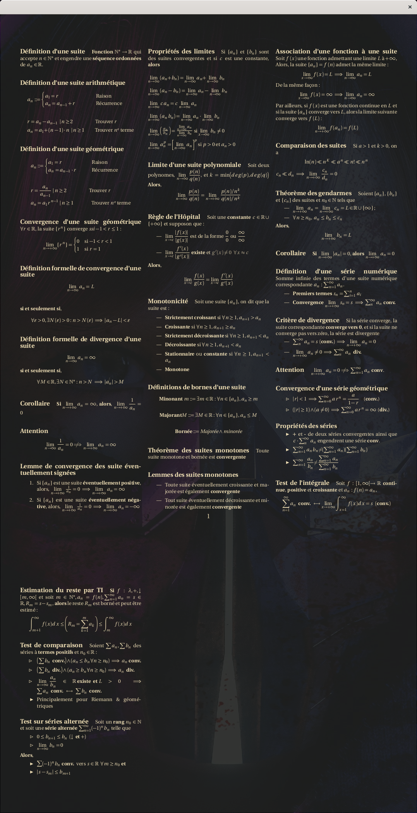

# Description
This section includes my notes for **week 1**. 

# Content

## Sequences
- Definition of a sequence and notations 
    1) Arithmetic sequences
    2) Geometric sequences 

- Formulas for **n**th term and reason 
- Formal definition of convergence and divergence of a sequence 
    1) Theorems and proofs

- Conditions of convergence and divergence of sequences that are *eventually signed*
- Limit properties of sequences 

- L'Hôpital's rule. 
- Monotonicity, moniring and majoring. 
- Association of a fonction to a sequence 
- Comparison of ordor of magnitude of sequences ln, n^k, a^n, n!, n^n, etc.  

  
  

## Series 
- Definition of a series and notations
- **Convergences tests** 
    1) Simple divergence test 
    2) Convergence of geometric series theorem 
    3) Integral test and estimation of remainder
    4) Comparison test 
    5) Test of alternating series 

## Cheatsheet

  
  

